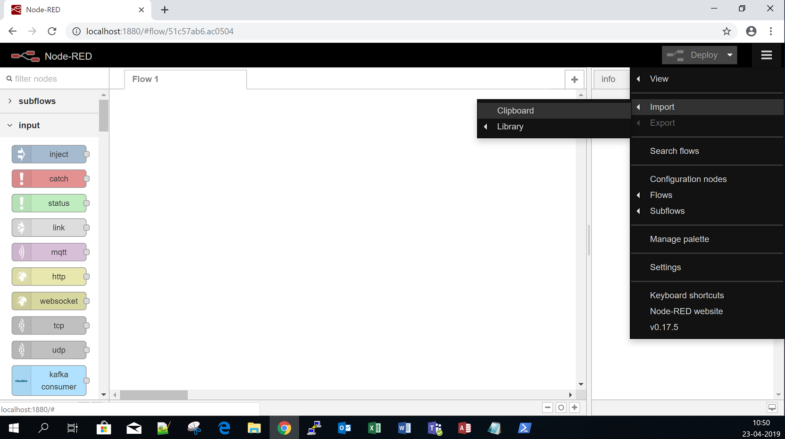

# DataRobotFactory

In a production environment the DataRobotFactory solution is based on a collection of Node-RED flows deployed from running Docker containers. However the following procedure explains how to install DataRobotFactory without the use of Docker.

# Node-RED

http://nodered.org

A visual tool for wiring the Internet of Things.

## Quick Start

Check out http://nodered.org/docs/getting-started/ for full instructions on getting
started.

1. `sudo npm install -g --unsafe-perm node-red`
2. `node-red`
3. Open <http://localhost:1880>

# Docker

https://www.docker.com/

Package software into standardized units for development, shipment and deployment. But the usage of Docker will not be explained any further in this document.

# Installation of DataRobotFactory

To get DataRobotFactory up and running you need to:
   1. Download the sagofonto-hepwat files.
   2. Install non npm packaged nodes.
   3. Install npm packaged nodes.
   4. Import flows, configure and deploy.

A prerequisite before actually running the flows is an installation of PostgreSQL, the HEPWAT database and MongoDB. The DataRobotFactory flows also contains a Kafka producer that expects you to have a host with a running Kafka installation available on port 9092.

## Quick Start

The following procedure explaining how to install the DataRobotFactory is based on an OS installation of ubuntu-16.04.1-server-amd64 but can easily be modified to be used with Windows.

1. Downloading the sagofonto-hepwat files

        git clone https://github.com/artogis/sagofonto-hepwat.git

2. Installing non npm packaged nodes
   
   From your download library enter the following command:

        cp -r sagofonto-hepwat/datarobotfactory/nodes/sagofonto $HOME/.node-red/node_modules/sagofonto

3. Installing npm packaged nodes

   To install the necessary npm packaged nodes, you can install them locally within your user data directory (by default, $HOME/.node-red):

        cd $HOME/.node-red
        npm install --unsafe-perm kafka-node avro-js node-opcua node-red-contrib-cloudera
        npm install --unsafe-perm node-red-contrib-opcua postgrestor
        npm install --unsafe-perm node-red-dashboard node-red-contrib-http-request 
        npm install --unsafe-perm node-red-contrib-https node-red-viseo-helper extend
        npm install --unsafe-perm node-red-contrib-csvtojson node-red-contrib-fs-ops
        npm install --unsafe-perm node-red-node-tail node-red-contrib-exit
        npm install --unsafe-perm node-red-contrib-http-request node-red-node-mongodb
   
   You will then need to stop and restart Node-RED for it to pick-up the new nodes.

4. Import, configure and deploy the flows

   Import the content of each file from /sagofonto-hepwat-master/sagofonto-hepwat-master/datarobotfactory/flows to the dashboard:

   

   Some of the nodes in the flows needs to be configured with e.g. host, port, user and password before you can finally deploy.